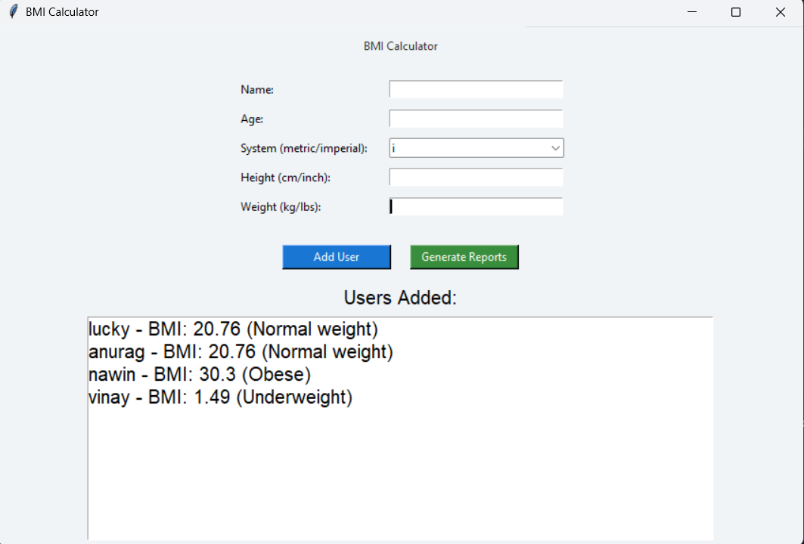
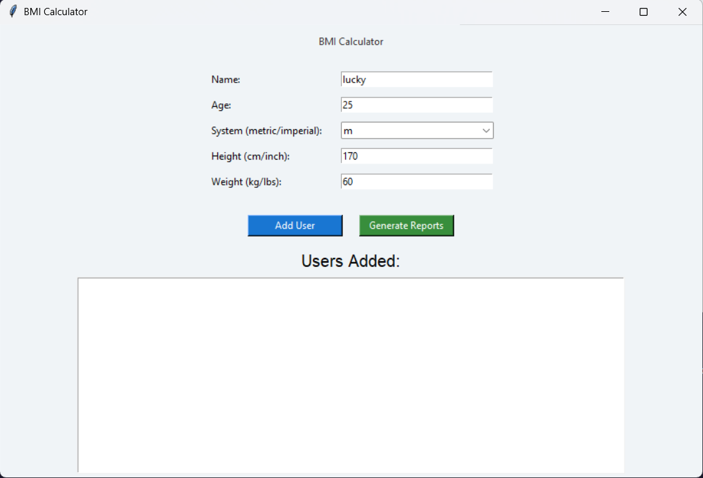
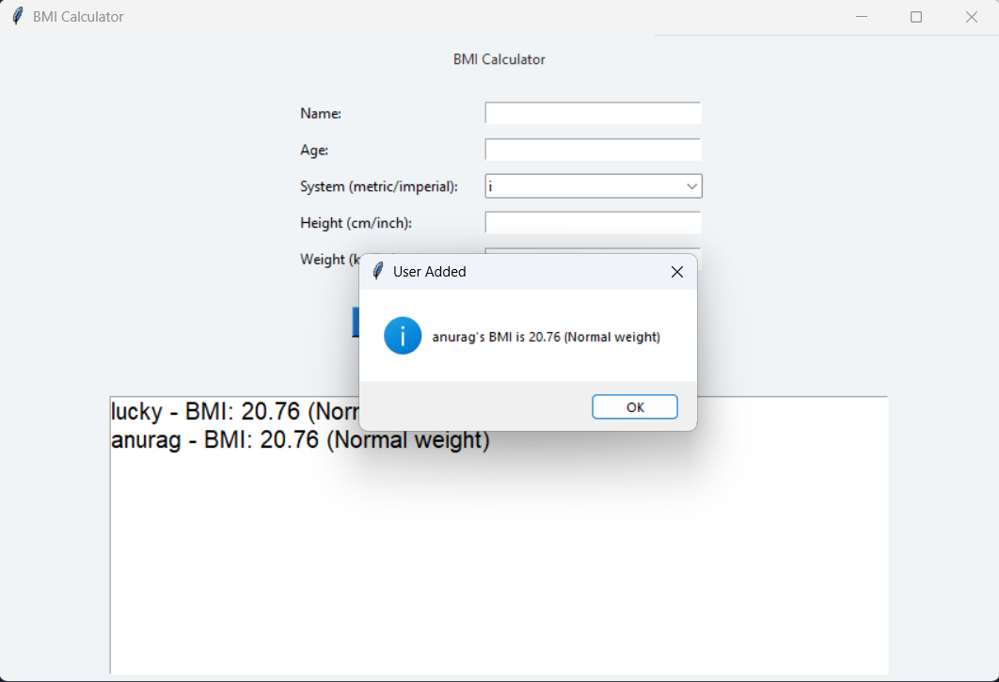
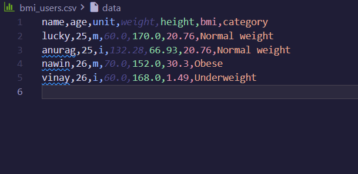
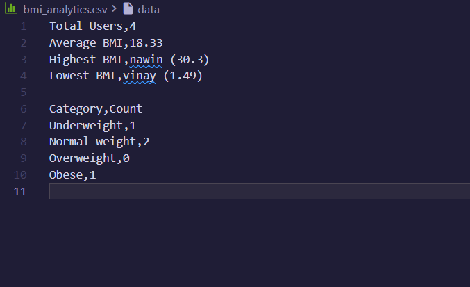

# BMI Calculator (Tkinter GUI)

This is a simple BMI (Body Mass Index) calculator built using Python and Tkinter.  
It allows you to enter details for multiple users, calculate their BMI, and generate CSV reports.

---

## Features

- Add multiple users (name, age, weight, height)

- Supports both metric (kg, cm) and imperial (lbs, inches) systems


- Calculates BMI and classifies it as:
  - Underweight
  - Normal weight
  - Overweight
  - Obese


- Shows a list of all added users

- Exports user data to `bmi_users.csv`

- Generates a summary report `bmi_analytics.csv` with:
  - Total users
  - Average BMI
  - Highest and lowest BMI
  - Count of users in each category
  

---

## How to Run

1. Make sure you have Python 3 installed.
2. Save the Python file (e.g., `bmi_calculator.py`)
3. Open a terminal or command prompt and run:

```bash
python bmi_calculator.py

or

open the file in vs code and run the program 
 
and you are good to go!